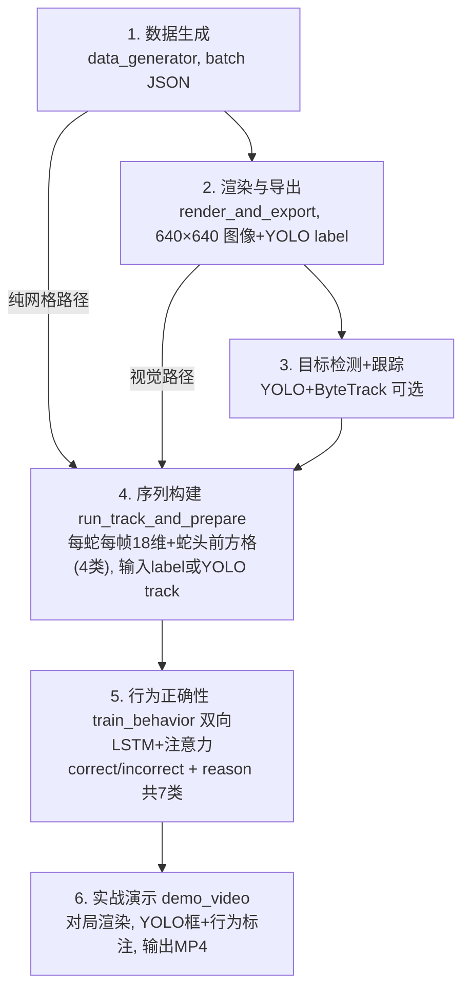

# behavior_detection

基于贪吃蛇游戏，创建行为识别 + 行为正确性检测的 DEMO，用于生成带标注的视频素材数据。

## 核心算法流程

整体 Pipeline 分为两条可选路径：**纯网格路径**（基于 scene 坐标）和 **视觉路径**（YOLO 检测 + 跟踪）。



### 流程说明

| 阶段 | 脚本 | 输入 | 输出 |
|------|------|------|------|
| 1. 数据生成 | `data_generator.py` | 随机种子、规则参数 | `batches/batch_*.json` |
| 2. 渲染导出 | `render_and_export.py` | batch JSON | `dataset/` (640×640 images + labels + metadata) |
| 3. 目标检测 | YOLO `train` / `track` | 渲染图像 | 检测框 + track_id |
| 4. 序列构建 | `run_track_and_prepare.py` | dataset（含 train/val） | `sequences/track_sequences.json`（每条序列带 `split`，与 dataset 一致） |
| 5. 行为训练 | `train_behavior.py` | sequences（按 `split` 划分 train/val）或 grid | `checkpoints/behavior/best.pt` |
| 6. 视频演示 | `demo_video.py` | batch + 模型权重 | 带标注的 MP4 视频 |

### 18 维连续特征 + 蛇头前方一格（4 类）+ 3 帧上下文（行为模型输入）

**特征约束**：仅使用 YOLO 能从图像检测到的信息（head/food/x2 位置），grid 与 track 两种路径完全一致。

每帧每蛇**连续特征**（18 维）：`[head_x, head_y, vel_x, vel_y, food_x, food_y, x2_x, x2_y, has_x2, dist_to_food, dist_to_x2, moving_towards_food, ate_food, ate_x2, is_dead, steps_since_food, ate_food_while_x2, about_to_timeout]`

- `ate_food` / `ate_x2`：由连续帧 head/food/x2 位置推导，YOLO 推理时同样可计算
- `is_dead`：蛇是否已撞击死亡（YOLO 5 类时 class 4=`snake_head_dead` 表示圆形蛇头，label 路径从解析结果读取）
- `steps_since_food`：自上次吃食物以来的帧数，归一化 `min(count/80, 1.0)`
- `about_to_timeout`：若**下一步再没吃到果子就超时**（80 步）则为 1，否则为 0
- **蛇头前方一格**（离散，Embedding 输入）：0=空，1=自己身体，2=其他蛇身体，3=其他蛇头；用于区分 self_collision / snake_collision 及碰撞部位
- 训练时默认将**前后共 3 帧**（1 前 + 当前 + 1 后）合并为 1 帧输入（3×18=54 维 + head_forward 嵌入）

---

## 游戏规则

- 无墙壁，蛇撞自己即结束
- 吃 1 个食物 +1 格长度、+1 分
- 每当食物被吃掉时，50% 概率同时生成一个「x2」
- 先吃 x2 再吃食物 → 该食物得 2 分；否则得 1 分
- x2 每波只生效一次，生成新食物时自动失效

## 行为标注

| 标注 | 含义 |
|------|------|
| `correct` / `ate_x2_then_food` | 先吃 x2 再吃食物 ✓ |
| `correct` / `ate_food_no_x2` | 无 x2 时吃食物 ✓ |
| `in_progress` | 进行中（未结束） |
| `incorrect` / `self_collision` | 撞自己 ✗ |
| `incorrect` / `snake_collision` | 蛇间碰撞 ✗ |
| `incorrect` / `x2_wasted` | 先吃食物导致 x2 浪费 ✗ |
| `incorrect` / `timeout` | 超时未吃食物 ✗ |

## 数据格式

batch JSON 结构（支持多蛇）：

```json
{
  "episodes": [
    {
      "scenes": [
        {
          "snakes": [
            { "body": [[x,y],...], "food": [x,y], "x2": [x,y]|null, "score": 0, "color_id": 0 }
          ],
          "step": 0
        }
      ],
      "label": "correct",
      "reason": "ate_food_no_x2",
      "snake_annotations": [
        { "label": "correct", "reason": "ate_food_no_x2" }
      ]
    }
  ]
}
```

每个 `scene` 为一帧状态；`snake_annotations[i]` 为第 i 条蛇的波级标注。

## 使用

### 1. 生成数据

```bash
# 默认：10 个 batch，每 batch 10 局，输出到 batches/
python data_generator.py

# 自定义参数（支持多进程加速）
python data_generator.py --batches 100 --batch-size 100 --output my_data --mistake-rate 0.2

# 使用 12 个进程并行生成
python data_generator.py -b 100 -s 100 -w 12
```

| 参数 | 默认 | 说明 |
|------|------|------|
| `-b, --batches` | 10 | batch 数量 |
| `-s, --batch-size` | 10 | 每 batch 局数 |
| `-o, --output` | batches | 输出目录 |
| `-w, --workers` | CPU 核心数 | 并行进程数 |
| `-m, --mistake-rate` | 0.15 | AI 犯错概率（先吃食物浪费 x2） |
| `-f, --max-foods` | 12 | 每局需吃完的食物波数 |

每个 batch 保存为独立 JSON，如 `batches/batch_00000.json`。每局存储完整场景序列。

### 完整训练流程（含 YOLO）

渲染输出 **640×640** 图像；蛇头视觉：开局菱形 → 三角(尖指方向) → 撞击圆形。

| 步骤 | 命令 | 说明 |
|------|------|------|
| 1 | 数据生成 | 多进程 `-w 12` 加速 |
| 2 | 渲染导出 | 640×640，全帧不跳帧 |
| 3 | YOLO 训练 | 可选，5 类含 snake_head_dead |
| 4 | 序列准备 | 路径 A 纯 label / 路径 B YOLO 跟踪 |
| 5 | 行为训练 | 双向 LSTM + 注意力；`--best-metric reason_f1` 选 best；`--patience` 早停 |
| 6 | 评估 | 自动搜索最优 F1 阈值，`--batch-size` 提速 |
| 7 | 演示视频 | `-d dataset` 与训练帧一致；`--draw-boxes` 绘制 YOLO 框 |

```bash
# 1. 数据生成（-w 12 多进程）
python data_generator.py --batches 10 --batch-size 100 -w 12

# 2. 渲染与导出 YOLO 数据集（640×640，全帧；-w 12 多进程）
python scripts/render_and_export.py --batches batches/ --output dataset --val-ratio 0.2 -w 12

# 3. (可选) YOLO 训练（5 类：snake_head, snake_body, food, x2, snake_head_dead；imgsz 与渲染一致）
yolo train model=yolov8n.pt data=dataset/data.yaml epochs=100 imgsz=640 batch=128

# 4. 序列准备（二选一）
# 路径 A：纯 label，无需 YOLO（-w 12 多进程）
python scripts/run_track_and_prepare.py --from-labels -d dataset -o sequences -w 12

# 路径 B：YOLO 跟踪（需先完成步骤 3）
python scripts/run_track_and_prepare.py -m runs/detect/train/weights/best.pt -d dataset -o sequences

# 5. 行为模型训练（双向 LSTM + 注意力；best 按 reason_f1 选取，50 epoch 无提升早停）
python scripts/train_behavior.py --data sequences/track_sequences.json -o checkpoints/behavior \
  --boost-incorrect --aug-multiscale --aug-frame-drop 0.1 --aug-noise 0.02 --epochs 1000 --patience 50

# 6. 评估（自动搜索最优 F1 阈值；--batch-size 256 大批量提速）
python scripts/eval_behavior.py -c checkpoints/behavior/best.pt -d sequences/track_sequences.json --batch-size 256

# 7. 演示视频（-d dataset 保证帧与训练一致；路径 B 可加 -m YOLO权重 --draw-boxes）
python scripts/demo_video.py -b batches/batch_00000.json -e 0 -c checkpoints/behavior/best.pt -d dataset -o demo.mp4
```

### 2. 回放演示

```bash
pip install pygame
python replay_ui.py
```

回放控制：
- **打开文件 (O)**：点击按钮或按 O 键选择 JSON 数据文件
- **空格**：播放/暂停
- **←/→**：上一帧/下一帧
- **A/D**：上一局/下一局
- **Home/End**：跳到开头/结尾

### 3. 渲染与导出 YOLO 数据集

```bash
# 640×640 全帧导出（不跳帧），多进程：-w 12
python scripts/render_and_export.py --batches batches/ --output dataset --val-ratio 0.2 -w 12
```

输出 `dataset/train`、`dataset/val`（640×640 images + labels + metadata.json）。划分按**局（episode）**：约 `--val-ratio` 比例的局整局进入 val，保证验证集样本量合理。`run_track_and_prepare` 会据此为每条序列写入 `split`，训练与评估的 train/val 与 dataset 一致。蛇头视觉：开局菱形、前进三角(尖指方向)、撞击圆形。

### 4. 序列准备（二选一）

```bash
# 纯 label：直接从 YOLO label 提取蛇头，无需运行 YOLO（-w 12 多进程）
python scripts/run_track_and_prepare.py --from-labels -d dataset -o sequences -w 12

# YOLO 跟踪：需先训练 YOLO，再跑 track（GPU 时默认单进程）
python scripts/run_track_and_prepare.py -m yolov8n.pt -d dataset -o sequences
```

### 5. 行为模型训练

模型结构：**双向 LSTM + 自注意力**（可用 `--no-bidirectional --no-attention` 禁用以兼容旧版）。best.pt 默认按 **reason_f1**（7 类宏平均）选取，`--patience 50` 早停。

```bash
# 纯网格（推荐先验证）
python scripts/train_behavior.py --data grid --batches batches/ -o checkpoints/behavior

# 序列数据（--boost-incorrect 提升错误检测；--best-metric reason_f1 稳健选 best）
python scripts/train_behavior.py --data sequences/track_sequences.json -o checkpoints/behavior \
  --boost-incorrect --patience 50 --epochs 1000

# 可选：--best-metric binary_f1 / composite；--patience 0 禁用早停
python scripts/train_behavior.py -d sequences/track_sequences.json -o checkpoints/behavior \
  --best-metric composite --patience 30

# 禁用新结构（与旧 checkpoint 一致）
python scripts/train_behavior.py -d sequences/track_sequences.json -o checkpoints/behavior --no-bidirectional --no-attention
```

### 6. 实战演示视频

```bash
# 行为标注（推荐 -d dataset 保证帧与训练一致）
python scripts/demo_video.py -b batches/batch_00000.json -e 0 -c checkpoints/behavior/best.pt -d dataset -o demo.mp4

# YOLO 框 + 行为联合标注（路径 B）
python scripts/demo_video.py -b batches/batch_00000.json -e 0 -m yolov8n.pt -c checkpoints/behavior/best.pt -d dataset -o demo.mp4 --draw-boxes
```

### 7. 全量评估（P、R、mAP50、mAP50-95）

默认**仅评估验证集**（`--split val`），与训练时的 val 一致，指标准确。自动搜索最优 F1 阈值，输出 YOLO 风格表格（表头 P/R/mAP50/mAP50-95，每类 + all）。

```bash
# 默认评估 val 集（与训练验证集一致）
python scripts/eval_behavior.py -c checkpoints/behavior/best.pt -d sequences/track_sequences.json

# 评估全部数据：--split all（旧版无 split 的 JSON 也请用此选项）
python scripts/eval_behavior.py -c best.pt -d sequences/track_sequences.json --split all

# 使用固定阈值：--no-threshold-search --incorrect-threshold 0.9
python scripts/eval_behavior.py -c best.pt -d sequences/track_sequences.json --no-threshold-search --incorrect-threshold 0.9

# 提升错误召回率：--reason-override
python scripts/eval_behavior.py -c best.pt -d sequences/track_sequences.json --reason-override

# 大批量评估提速：--batch-size 256（显存允许时）
python scripts/eval_behavior.py -c best.pt -d sequences/track_sequences.json --batch-size 256
```

### 8. 代码调用

```python
from data_generator import generate_dataset, run_episode

# 生成数据：100 个 batch，每 batch 100 局
generate_dataset(num_batches=100, batch_size=100, output_dir="batches")

# 单局运行（含 AI 犯错概率）
ep = run_episode(seed=42, max_foods=12, ai_mistake_rate=0.15)
print(ep["label"], ep["reason"], len(ep["scenes"]))
```

---

## 依赖

| 用途 | 包 |
|------|-----|
| 游戏 / 回放 / 渲染 | `pygame` |
| 目标检测 / 跟踪 | `ultralytics` (YOLO) |
| 行为模型 | `torch` |
| 视频输出 | `opencv-python` |

---

## 项目结构

```
behavior_detection/
├── data_generator.py       # 数据生成
├── game.py, ai.py          # 游戏逻辑与 AI
├── replay_ui.py            # 回放演示
├── scripts/
│   ├── render_and_export.py   # 渲染 → YOLO 数据集
│   ├── preview_labels.py      # 标注预览
│   ├── run_track_and_prepare.py  # 序列构建
│   ├── train_behavior.py       # 行为模型训练
│   ├── infer_behavior.py       # 行为推理
│   └── demo_video.py           # 实战演示视频
├── models/
│   └── behavior_correctness.py # 双向LSTM+注意力 行为/正确性模型
├── batches/                 # 生成的对局数据
├── dataset/                 # 渲染输出 (640×640 YOLO 数据集)
├── sequences/               # 序列特征
└── checkpoints/behavior/    # 模型权重
```
